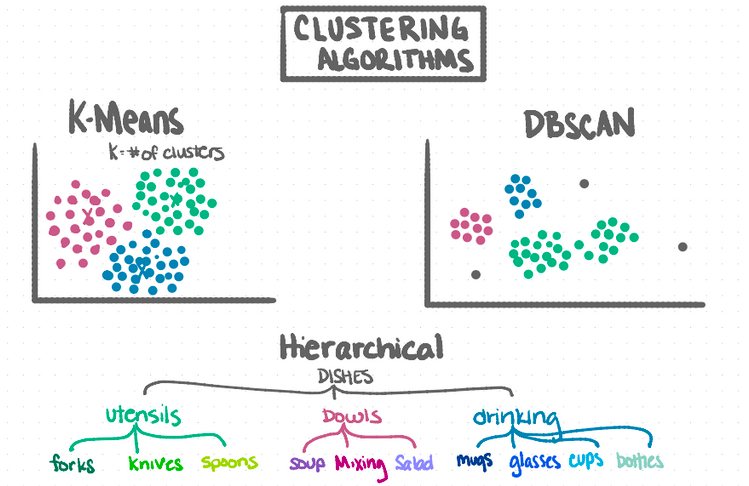

## To err is Human, To Predict is Divine

---
- [Introduction](#introduction)
- [Data](#data)
- [Planning pipeline](#planning-pipeline)
- [Hypotheses](#hypotheses)
- [Results](#results)
- [Recommendations](#recommendations)

## Introduction

## Data

| Feature                        | Description                                                                                                            |
|--------------------------------|------------------------------------------------------------------------------------------------------------------------|
| 'architecturalstyletypeid'     |  Architectural style of the home (i.e. ranch, colonial, split-level, etc…)                                             |
| 'basementsqft'                 |  Finished living area below or partially below ground level                                                            |
| 'bathroomcnt'                  |  Number of bathrooms in home including fractional bathrooms                                                            |
| 'bedroomcnt'                   |  Number of bedrooms in home                                                                                            |
| 'buildingqualitytypeid'        |  Overall assessment of condition of the building from best (lowest) to worst (highest)                                 |
| 'finishedfloor1squarefeet'     |  Size of the finished living area on the first (entry) floor of the home                                               |
| 'calculatedfinishedsquarefeet' |  Calculated total finished living area of the home                                                                     |
| 'finishedsquarefeet6'          | Base unfinished and finished area                                                                                      |
| 'finishedsquarefeet12'         | Finished living area                                                                                                   |
| 'finishedsquarefeet13'         | Perimeter  living area                                                                                                 |
| 'finishedsquarefeet15'         | Total area                                                                                                             |
| 'finishedsquarefeet50'         |  Size of the finished living area on the first (entry) floor of the home                                               |
| 'fips'                         |  Federal Information Processing Standard code -  see https://en.wikipedia.org/wiki/FIPS_county_code  |
| 'fireplacecnt'                 |  Number of fireplaces in a home (if any)                                                                               |
| 'garagecarcnt'                 |  Total number of garages on the lot including an attached garage                                                       |  
| 'latitude'                     |  Latitude of the middle of the parcel multiplied by 10e6                                                               |
| 'longitude'                    |  Longitude of the middle of the parcel multiplied by 10e6                                                              |
| 'lotsizesquarefeet'            |  Area of the lot in square feet                                                                                        |
| 'regionidcounty'               | County in which the property is located                                                                                |
| 'regionidcity'                 |  City in which the property is located (if any)                                                                        |
| 'regionidzip'                  |  Zip code in which the property is located                                                                             |   
| 'yearbuilt'                    |  The Year the principal residence was built                                                                            |
| 'taxvaluedollarcnt'            | The total tax assessed value of the parcel                                                                             |
| 'structuretaxvaluedollarcnt'   | The assessed value of the built structure on the parcel                                                                |
| 'landtaxvaluedollarcnt'        | The assessed value of the land area of the parcel                                                                      |
| 'taxamount'                    | The total property tax assessed for that assessment year                                                               |

## Planning pipeline

Step 1: Plan

*Business objective:*

*Project objective:*

Step 2: Acquire

If data is in a SQL database, run select * from zillow.2017 via SQL IDE.
If data is a csv file, use pandas, e.g. pandas.read_csv().
These steps are covered in acquire.py.

Step 3: Prepare Data

There are no missing values.
Convert all features to floats or categorical variables using one-hot encoding.
Split data into 70/15/15 training/validation/test sets.
These steps are covered in prepare.py.

Step 4: Explore & Preprocess

Visualize attributes & interactions (Python: seaborn and matplotlib).
Analyze: statistically and more generally (Python: statsmodels, numpy, scipy, scikit-learn).

Step 5: Model

Train on minority oversampled data using SMOTE.

Models used:

* k-means
* DBSCAN
* Hierarchical

## Hypotheses

### H0 There is no linear correlation between log error and square footage.

### H1 There is a linear correlation between log error and square footage. tenure.

* Pearson correlation = 0.000
* p-value             = 0.000

## Results

| model | beep | boop | bop |
| --- | --- | --- | --- |
| baseline | .1 | 1 | .1 |
| k-means | .1 | .1 | .1 |

* I recommend we do better.

